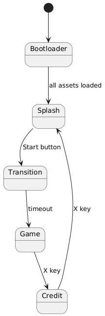

# TP : Navigation à travers les scènes dans un jeu Phaser

## Objectifs pédagogiques

1. Réaliser un plan de navigation entre les scènes dans un jeu.
2. Préparer une scène spécifique pour le jeu.

## Définition de l'objectif

- Gestion des inputs avec Phaser.
- Lancement des scènes Phaser.
- Nous souhaitons réaliser le plan de navigation suivant :
  - La première scène est `Bootloader`.
  - Une fois les ressources chargées, `Bootloader` permet de passer à `Splash`.
  - Si le bouton `Start` est cliqué, `Splash` permet de passer à `Transition`.
  - `Transition` affiche un message, puis passe à `Game`.
  - `Game` permet de passer à `Credits` si la touche `X` est enfoncée.
  - `Credits` permet de revenir à `Splash` si la touche `X` est enfoncée.



---

## Étapes du TP

### Étape 1 : Point de départ

1. **Récupérer le projet** de l'étape 2, soit par Git, soit par un fichier compressé.
2. **Ouvrir le projet** avec **Visual Studio Code**.
3. **Lancer Live Server** pour consulter la page **index.html** dans un navigateur.

---

### Étape 2 : Consulter le fichier `main.js`

- Remarquez que toutes les scènes du jeu sont importées et déclarées dans la configuration de Phaser :

```javascript
...
scene: [Bootloader, Splash, Transition, Game, Credit]
...
```

Votre objectif est de réaliser la scène `Game` qui est dans le fichier `scenes/game.js`

---

### Étape 3 : Réalisation de la scène **Game**

- Les autres scènes du jeu sont déjà réalisées pour vous.
- Votre objectif est de **réaliser la scène Game**.
- Vous pouvez consulter les autres scènes pour vous aider.

#### 1. **Initialisation**

- Pour utiliser le clavier et les touches de navigation (les flèches du clavier), nous devons créer les **touches de curseur**.
- Dans la méthode **`init()`**, ajoutez ce code :

```javascript
...
this.cursors = this.input.keyboard.createCursorKeys();
...
```
Ce code va créer un ensemble de touches de contrôle qui permettent de détecter les flèches directionnelles du clavier (haut, bas, gauche, droite). Cela permet au joueur de déplacer un personnage ou de naviguer dans une scène du jeu en utilisant les touches fléchées.

*Explication détaillée :*

- `this.input.keyboard.createCursorKeys()` : Cette méthode de Phaser crée un objet contenant des références aux touches de direction du clavier (haut, bas, gauche, droite).
- `this.cursors` : La variable cursors stocke l'objet créé. Elle contient des propriétés telles que this.cursors.up, this.cursors.down, this.cursors.left, et this.cursors.right, qui permettent de vérifier l'état des touches fléchées.

#### 2. **La méthode `create()`**

- **Changer le background** :
  - Nous allons modifier le background de la scène avec une couleur :

```javascript
...
this.cameras.main.setBackgroundColor(0x3c97a6);
...
```

- **Ajouter une touche de contrôle** :
  - Pour ajouter une touche de contrôle clavier, nous devons la déclarer dans le système **Phaser**. Déclarez la touche **X** comme suit :

```javascript
...
this.X = this.input.keyboard.addKey(Phaser.Input.Keyboard.KeyCodes.X);
...
```

  - Il est préférable de le faire dans une fonction annexe `addExit()`, puis d'appeler cette fonction dans **`create()`** :

```javascript
addExit() {
    this.X = this.input.keyboard.addKey(Phaser.Input.Keyboard.KeyCodes.X);
}

create() {
    ...
    this.addExit();
    ...
}
```

- **Affichage d'un texte** :
  - Consultez la scène **Credit** pour voir comment afficher un texte à l'utilisateur et l'inviter à taper une touche pour quitter la scène.
  - Vous pouvez utiliser ce type de code pour afficher un texte :

```javascript
this.add.text(100, 100, 'Press X to go to Credits', 
                { font: '24px Arial', fill: '#ffffff' }
             );
```

---

### Étape 4 : La méthode `update()`

- Cette méthode est appelée à **chaque cycle de jeu**.
- Nous allons vérifier l'état de la touche **X**.
- Si la touche est enfoncée, nous allons réaliser la transition vers la scène **Credit** :

```javascript
update() {
    if (Phaser.Input.Keyboard.JustDown(this.X)) {
        this.scene.start("Credit");
    }
}
```

---

## Résumé

Dans cette étape, vous avez appris à :

- Créer une scène Phaser et y ajouter des contrôles clavier.
- Gérer les transitions entre différentes scènes du jeu à l'aide de conditions basées sur les **inputs**.
- Modifier l'affichage et personnaliser une scène avec du texte et des interactions. 

L'étape suivante pourrait consister à réaliser un gameplay simple à notre jeu.