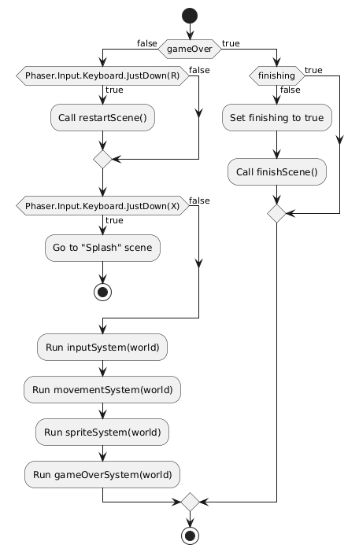
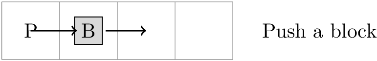

# gameprogrammingcourse_step1_student
---
header-includes:
    - \usepackage{tikz}
---

# TP Step 4: Game Prototype 2

## Learning Objectives
- Understand the concept of challenge in a game
- Introduction to level design

## Step Objectives
- Add the Block component
- Add the Block entity
- Improve the `movementSystem` to handle collisions between the player and blocks

## Introduction

We now want to add entities to the game to prevent the player from reaching their goal. These entities will be represented by blocks that the player can only move by pushing.

By pushing the blocks, the player will need to clear a path to the exit and thus complete the level.

## Steps to follow

### 1. Starting Point
- Retrieve the project from step 4 either via **git** or from a decompressed file.
- Open the project directory using **Visual Studio Code**.
- Launch **Live Server** to view the `index.html` page in a browser.

### 2. Understanding how the game map loads

In `game.js`, check the `loadGameData()` function:

```javascript
loadGameData() {
    this.levelData = this.cache.json.get(`levelData${this.number}`);
    if (!this.levelData) {
        this.scene.start("Splash");
    }
}
```

Each level in our game is identified by a number. This function will request a JavaScript object (JSON) representing the description of the level's map. All these levels are available in the `assets/levels` directory.

Here is an example of such a level in JSON:

```json
{
    "stage": {
        "level": 0,
        "grid": {
            "width": 6,
            "height": 6
        },
        "exit": {
            "x": 5,
            "y": 2
        },
        "blocks": [
            {
                "id": 1,
                "position": { "x": 2, "y": 2 }
            },
            {
                "id": 2,
                "position": { "x": 3, "y": 1 }
            },
            {
                "id": 3,
                "position": { "x": 3, "y": 3 }
            },
            {
                "id": 4,
                "position": { "x": 4, "y": 2 }
            }
        ]
    },
    "player": {
        "position": { "x": 3, "y": 2 }
    }
}
```

In this description, we find the following information:

- The size of the game grid `stage.grid`
- The list of blocks in `stage.blocks`
- The exit door position `stage.exit`
- The player's initial position `player.position`

### 3. Understanding the internal game state model

We will create variables that represent the state of our game. These variables are created by the `gameStateConfig()` function:

```javascript
gameStateConfig() {
    this.gameState = {};
    this.gameState.grid = this.createGameState(this.levelData);
    this.solved = false;
    this.gameOver = false;
    this.finishing = false;
}
```

- The `solved` attribute indicates whether the player has solved the puzzle.
- The `gameOver` attribute tells us if the game is over.
- The `finishing` attribute tells us if the game is finished and we are finalizing the scene before exiting.
- The `gameState` attribute defines an internal representation of the game board as a matrix. Each cell in the matrix contains `undefined` if no entity is present. If an entity is present at that position, the cell will contain its identifier, which allows it to be found in the ECS world.

### 4. Adding the Block component

Add a `Block` component, which will be a tag to type the entities representing an obstacle in the game.

Suggested code in `Bloc.js`:

```javascript
export const Bloc = defineComponent();
```

### 5. Implementing the movement system

Check the code in `movementSystem.js`. The `tryMove` function tries to move the player when possible.

The player's movement in a direction is possible in the following cases:

- The destination cell is free 

- The destination cell is occupied, but it is possible to push the block in the same direction because the next cell is free.



Currently, the function only handles the `right` direction. Complete this code to handle the other directions.

You can check the state of the cells in the state variable `scene.gameState.grid`. You must update this variable when entities are moved.

### 6. Testing and validation

Now, test your application. Verify that the game rules are correctly followed: the player must be able to push blocks if the space behind them is free, and the player must reach the exit to complete the level.
