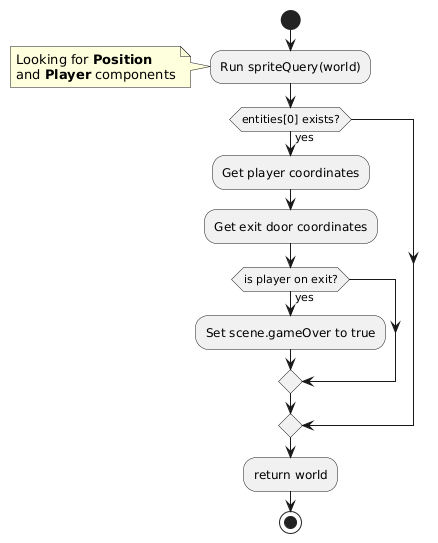

# gameprogrammingcourse_step1_student
# Lab: Game Prototype 1

## Learning Objectives

1. Set up the components, entities, and systems of a game prototype.
2. Use design patterns such as **Factory**.

## Step Objectives

- **Add components**: `Movement`, `Player`.
- **Add entities**: `exit` (exit door) and `player`.
- **Add systems**: `gameOverSystem`, `inputSystem`, `movementSystem`, `spriteSystem`.

## Introduction

We are going to create an incomplete prototype of our game. This prototype will focus on a part of the gameplay, where the player can move within the scene to reach the exit from the starting point.

### Current Prototype Architecture

#### Components

1. **Input** 

The `Input` component is used to store the direction in which the player wants to move. The direction is represented by a number indicating whether the player is moving up, down, left, or right.

<details>
<summary>Code exemple</summary>
<code>
export const Input = defineComponent({ direction: Types.i8 });
</code>
</details>


2. **Movement**


The `Movement` component stores the current movement direction and a **dirty** flag (true or false) that indicates whether the movement should be applied during the update cycle.

<details>
<summary>Code exemple</summary>
<code>
export const Movement = defineComponent({ direction: Types.i8, dirty: Types.i8 });
</code>
</details>


3. **Player**

```javascript
export const Player = defineComponent();
```

The `Player` component is a simple tag used to identify the entity that represents the player in the game. Components without attributes are known as `tags`. They provide information about the type of entity.

4. **Position**

```javascript
export const Position = defineComponent({ x: Types.i8, y: Types.i8 });
```

The `Position` component stores the **x** and **y** coordinates of an entity on the game's grid. It is used to locate the entity in the 2D space.

5. **Sprite**

```javascript
export const Sprite = defineComponent({ texture: Types.ui8 });
```

The `Sprite` component associates a texture with the entity for its graphical representation on the screen. The texture is identified by an unsigned integer index (`ui8`).

#### Entities

1. **Exit**

Represents the goal (exit door) that the player must reach to complete the level.

- **Components**:
    - `Position`
    - `Sprite`

**Code Example**:

```javascript
const eid = addEntity(this.world);
addComponent(this.world, Position, eid);
addComponent(this.world, Sprite, eid);
Position.x[eid] = x;
Position.y[eid] = y;
Sprite.texture[eid] = 1;  // Door texture
return eid;
```

2. **Player**

The player's avatar in the game.

- **Components**:
    - `Input`
    - `Position`
    - `Player`
    - `Sprite`
    - `Movement`

**Code Example**:

```javascript
const eid = addEntity(this.world);
addComponent(this.world, Input, eid);
addComponent(this.world, Position, eid);
addComponent(this.world, Player, eid);
addComponent(this.world, Sprite, eid);
addComponent(this.world, Movement, eid);
Position.x[eid] = x;
Position.y[eid] = y;
Sprite.texture[eid] = 0;  // Player texture
return eid;
```

#### Systems

1. **gameOverSystem**

This system checks if the game is over. It simply checks if the player is at the exit (door).

2. **inputSystem**

This system reads the player's keyboard inputs and converts them into movement actions.

3. **movementSystem**

This system applies the movement commands and moves the entity within the 2D scene, provided the movement action is valid (within the scene boundaries).

4. **spriteSystem**

This system handles the graphical representation of entities by updating the Phaser sprites corresponding to the entities.

#### Scenes

We keep the same scenes: `Bootloader`, `Splash`, `Transition`, `Game`, and `Credits`.

---

## Work Steps

### Starting Point

1. **Get the project** from Step 3, either via Git or from a compressed file.
2. **Open the project** with **Visual Studio Code**.
3. **Run Live Server** to view the **index.html** page in a browser.
4. Check the following files to help you implement the missing programs:
    - **Components**: `Input.js`, `Position.js`, `Sprite.js`
    - **Scene**: `game.js`
    - **Systems**: `gameOverSystem.js`

---

### Creating the Missing Components

1. **Component `Input`**:

The `Input` component is used to capture the player's movement direction.

<details>
<summary>Hint</summary>
<code>
export const Input = defineComponent({ direction: Types.i8 });
</code>
</details>


2. **Component `Movement`**:

The `Movement` component stores the movement direction and a **dirty** flag to indicate if the movement should be applied.

<details>
<summary>Hint</summary>
<code>
export const Movement = defineComponent({ direction: Types.i8, dirty: Types.i8 });
</code>
</details>

3. **Component `Player`**:

The `Player` component is a simple marker to identify the entity controlled by the player.

Code example:


<details>
<summary>Hint</summary>
<code>
export const Player = defineComponent();
</code>
</details>

---

### Creating the Missing Entities

1. **Entity `exit`**:

The `exit` entity represents the exit door.

<details>
<summary>Hint</summary>
<code>
const eid = addEntity(this.world);
addComponent(this.world, Position, eid);
addComponent(this.world, Sprite, eid);
Position.x[eid] = x;
Position.y[eid] = y;
Sprite.texture[eid] = 1;  // Door texture
return eid;
</code>
</details>

Modify the file `entities/exit.js` to create entities of this type. 
Notice that we are using the Factory design pattern here.

2. **Entity `player`**:

The `player` entity represents the player's avatar in the game.

<details>
<summary>Hint</summary>

Here is a suggestion for creating it:

<code>
const eid = addEntity(this.world);
addComponent(this.world, Input, eid);
addComponent(this.world, Position, eid);
addComponent(this.world, Player, eid);
addComponent(this.world, Sprite, eid);
addComponent(this.world, Movement, eid);
Position.x[eid] = x;
Position.y[eid] = y;
Sprite.texture[eid] = 0;  // Player texture
return eid;
</code>
</details>

Modify the file `entities/player.js` to create entities of this type. 
Notice that we are using the Factory design pattern here.

---

### Implementing the `update()` function in the **Game** Scene

Your goal is to implement the missing code for the **`update()`** function in the **Game** scene (`scenes/game.js`).

This function is executed every update cycle and must perform the following actions:

1. Check if the game is not over.
2. Check if the player wants to quit the scene.
3. Run the **inputSystem**, **movementSystem**, **spriteSystem**, and **gameOverSystem** in that order.


The functionality of the `Game.update()` function is detailed in _Diagram 1_.

<details>
<summary>Hint</summary>

Here is a suggestion for creating it:

<code>
update(t, dt) {
    if (!this.gameOver) {
        if (Phaser.Input.Keyboard.JustDown(this.R)) {
            this.restartScene();
        }
        if (Phaser.Input.Keyboard.JustDown(this.X)) {
            this.scene.start("Splash");
        }
        this.inputSystem(this.world);
        this.movementSystem(this.world);
        this.spriteSystem(this.world);
        this.gameOverSystem(this.world);
    } else {
        if (!this.finishing) {
            this.finishing = true;
            this.finishScene();
        }
    }
}
</code>
</details>

---

### Understanding the gameOver System

Check the file **`gameOverSystem.js`** to understand how this system works.



Here is a detailed description of how the `gameOver` system works (see _Diagram 2_):

1. **Run `spriteQuery(world)`**
   The process begins by executing the **`spriteQuery(world)`** function. This function looks for entities in the game world that have both `Position` and `Player` components.

2. **Check if an entity exists**
   Once the query is executed, it checks if the first entity found (in this case, `entities[0]`) exists. This ensures that there is a player in the game scene.

   - **If the entity exists**: the process continues.
   - **If the entity does not exist**: the function simply returns the game world without taking any further action.

3. **Retrieve the player and exit coordinates**
   If an entity (the player) exists, the player's coordinates and the exit door's coordinates are retrieved. These coordinates are needed to check if the player has reached the exit.

4. **Check the win condition**
   Next, it checks if the player's coordinates match those of the exit door:
   - If the **player is at the exit** (i.e., the player's coordinates match the exit's), the game is over, and the **`scene.gameOver`** attribute is set to **true** to indicate the game has ended.

5. **Return the game world**
   After performing all checks, the function returns the **updated game world**, potentially with the end-of-game state if the player reached the exit.

---

### Understanding the Movement System

- Check the file **`movementSystem.js` to understand how the movement system works.
- Try to understand how movements are applied to entities and how the system manages position updates.

---

### Testing and Validation

1. Test your application: You should be able to move the player and exit the scene once the game is over.
2. Modify the level settings: Check the `assets/levels/level0.json` file. Modify the player and exit positions, then observe the result in the game.

---

## Conclusion

You have now implemented a simple game prototype using ECS components with Phaser. We will expand this prototype by adding more challenge and refining the systems and interactions.

