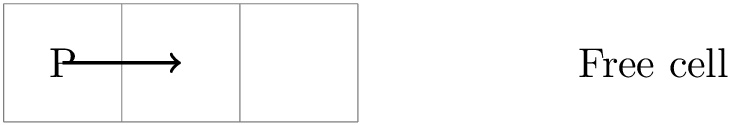

# TP : Prototype 1 du jeu

## Objectifs pédagogiques

1. Mettre en place les composants, entités, et systèmes d'un prototype de jeu.
2. Utiliser des patterns de design, comme **Factory**.

## Objectifs de l'étape

- **Ajout de composants** : `Movement`, `Player`.
- **Ajout d'entités** : `exit` (porte de sortie) et `player`.
- **Ajout de systèmes** : `gameOverSystem`, `inputSystem`, `movementSystem`, `spriteSystem`.

## Introduction

Nous allons réaliser un prototype (incomplet) de notre jeu. Ce prototype se concentre sur une partie du gameplay, où le joueur peut se déplacer dans la scène pour atteindre la sortie à partir de son point de départ.

### Architecture actuelle du prototype

#### Les composants

1. **Input**

```javascript
    export const Input = defineComponent({ direction: Types.i8 });
```

Le composant `Input` permet de stocker la direction dans laquelle le joueur souhaite se déplacer. La direction est représentée par un nombre indiquant si le joueur se déplace vers le haut, bas, gauche ou droite.


    

2. **Movement**

```javascript
    export const Movement = defineComponent({ direction: Types.i8, dirty: Types.i8 });
```
    
Le composant `Movement` stocke la direction du mouvement en cours et un indicateur **dirty** (faux ou vrai), qui précise si le mouvement doit être appliqué dans le cycle de mise à jour.

3. **Player**

```javascript
    export const Player = defineComponent();
```

Le composant `Player` est un simple tag utilisé pour identifier l'entité qui représente le joueur dans le jeu. Nous appelons les composants sans attributs des `tags`. Ils donnent des informations sur le type de l'entités.

4. **Position**

```javascript
    export const Position = defineComponent({ x: Types.i8, y: Types.i8 });
```

Le composant `Position` permet de stocker les coordonnées **x** et **y** d'une entité sur la grille du jeu. Il sert à localiser l'entité dans l'espace 2D.

5. **Sprite**

```javascript
    export const Sprite = defineComponent({ texture: Types.ui8 });
```

Le composant `Sprite` associe une texture à l'entité pour sa représentation graphique à l'écran. La texture est identifiée par un index entier non signé (`ui8`).

#### Les entités

1. **Exit**

Représente l'objectif (porte de sortie) que le joueur doit atteindre pour terminer le niveau.

- **Composants** :
    - `Position`
    - `Sprite`

**Exemple de code :**

```javascript
    const eid = addEntity(this.world);
    addComponent(this.world, Position, eid);
    addComponent(this.world, Sprite, eid);
    Position.x[eid] = x;
    Position.y[eid] = y;
    Sprite.texture[eid] = 1;  // Texture de la porte
    return eid;
```

2. **Player**

Avatar du joueur dans le jeu.

- **Composants** :
    - `Input`
    - `Position`
    - `Player`
    - `Sprite`
    - `Movement`


**Exemple de code :**

```javascript
    const eid = addEntity(this.world);
    addComponent(this.world, Input, eid);
    addComponent(this.world, Position, eid);
    addComponent(this.world, Player, eid);
    addComponent(this.world, Sprite, eid);
    addComponent(this.world, Movement, eid);
    Position.x[eid] = x;
    Position.y[eid] = y;
    Sprite.texture[eid] = 0;  // Texture du joueur
    return eid;
```

#### Les systèmes

1. **gameOverSystem**

Ce système vérifie si le jeu est terminé. Il contrôle simplement si le joueur se trouve sur la sortie (porte).

2. **inputSystem**

Ce système lit les commandes clavier du joueur et transforme ces commandes en actions de mouvement.

3. **movementSystem**

Ce système applique les commandes de mouvement et déplace l'entité dans la scène 2D, si l'action de mouvement est légale (dans les limites de la scène).

4. **spriteSystem**

Ce système gère la représentation graphique des entités en mettant à jour les sprites Phaser correspondant aux entités.

#### Les scènes

Nous conservons les mêmes scènes : `Bootloader`, `Splash`, `Transition`, `Game`, et `Credits`.

---

## Étapes de travail

### Point de départ

1. **Récupérer le projet** de l'étape 3, soit via Git, soit via un fichier compressé.
2. **Ouvrir le projet** avec **Visual Studio Code**.
3. **Lancer Live Server** pour consulter la page **index.html** dans un navigateur.
4. Consultez les fichiers suivants pour vous aider à réaliser les programmes manquants :
    - **Composants** : `Input.js`, `Position.js`, `Sprite.js`
    - **Scène** : `game.js`
    - **Systèmes** : `gameOverSystem.js`

---

### Réalisation des composants manquants

1. **Composant `Input`** :
Le composant `Input` est utilisé pour récupérer la direction de déplacement du joueur.

Exemple de code:
```javascript
    export const Input = defineComponent({ direction: Types.i8 });
```

2. **Composant `Movement`** :

Le composant `Movement` permet de stocker la direction du mouvement et un indicateur **dirty** pour marquer si le mouvement doit être appliqué.

Exemple de code:

```javascript
    export const Movement = defineComponent({ direction: Types.i8, dirty: Types.i8 });
```

3. **Composant `Player`** :

Le composant `Player` est un simple marqueur permettant d'identifier l'entité contrôlée par le joueur.

Exemple de code:

```javascript
    export const Player = defineComponent();
```

---

### Réalisation des entités manquantes

1. **Entité `exit`** :

L'entité `exit` représente la porte de sortie.

Suggestion de code pour la créer:

```javascript
    const eid = addEntity(this.world);
    addComponent(this.world, Position, eid);
    addComponent(this.world, Sprite, eid);
    Position.x[eid] = x;
    Position.y[eid] = y;
    Sprite.texture[eid] = 1;  // Texture de la porte
    return eid;
```

Modifiez le fichier `entities/exit.js` pour créer des entités de ce type.
Vous remarquez que nous utilisons ici le pattern design Factory.

2. **Entité `player`** :

L'entité `player` représente l'avatar du joueur dans le jeu. 

Voici une suggestion comment la créer :

```javascript
    const eid = addEntity(this.world);
    addComponent(this.world, Input, eid);
    addComponent(this.world, Position, eid);
    addComponent(this.world, Player, eid);
    addComponent(this.world, Sprite, eid);
    addComponent(this.world, Movement, eid);
    Position.x[eid] = x;
    Position.y[eid] = y;
    Sprite.texture[eid] = 0;  // Texture du joueur
    return eid;
```

Modifiez le fichier `entities/player.js` pour créer des entités de ce type.
Vous remarquez que nous utilisons ici le pattern design Factory.


---

### Programmation de la fonction `update()` de la scène **Game**

Votre objectif est de réaliser le code manquant pour la fonction **`update()`** dans la scène **Game** (`scenes/game.js`). 

Cette fonction est exécutée à chaque cycle de mise à jour et doit accomplir les actions suivantes :

1. Vérifier que le jeu n'est pas terminé.
2. Vérifier si le joueur souhaite quitter la scène.
3. Exécuter les systèmes **inputSystem**, **movementSystem**, **spriteSystem**, et **gameOverSystem** dans cet ordre.



Le fonctionnement de la fonction `Game.update()` est précisé dans _Diagram 1_.

**Exemple de code :**

Voici une suggestion de code pour vous aider à réaliser cette fonction:

```javascript
update(t, dt) {
    if (!this.gameOver) {
        if (Phaser.Input.Keyboard.JustDown(this.R)) {
            this.restartScene();
        }
        if (Phaser.Input.Keyboard.JustDown(this.X)) {
            this.scene.start("Splash");
        }
        this.inputSystem(this.world);
        this.movementSystem(this.world);
        this.spriteSystem(this.world);
        this.gameOverSystem(this.world);
    } else {
        if (!this.finishing) {
            this.finishing = true;
            this.finishScene();
        }
    }
}
```

---

### Comprendre le système de gameOver

Consultez le fichier **`gameOverSystem.js`** pour comprendre le fonctionnement de ce système.


Voici une description détaillée du fonctionnement du système `gameOver` (voir _Diagram 2_):

1. **Exécution de la requête `spriteQuery(world)`**
Le processus commence par exécuter la fonction **`spriteQuery(world)`**. Cette fonction cherche les entités dans le monde de jeu qui possèdent à la fois les composants `Position` et `Player`.

2. **Vérification de l'existence d'une entité**
Une fois la requête exécutée, on vérifie si la première entité trouvée (ici, `entities[0]`) existe. Cela garantit qu'il y a bien un joueur dans la scène du jeu.

- **Si l'entité existe** : le processus continue.
- **Si l'entité n'existe pas** : la fonction retourne simplement le monde de jeu sans faire d'autres actions.

3. **Récupération des coordonnées du joueur et de la porte de sortie**
Si une entité (le joueur) existe, les coordonnées du joueur et de la porte de sortie sont récupérées. Ces coordonnées sont nécessaires pour vérifier si le joueur est arrivé à la porte de sortie.

4. **Vérification de la condition de victoire**
Ensuite, on vérifie si les coordonnées du joueur correspondent à celles de la porte de sortie :
- Si le **joueur est sur la porte de sortie** (c'est-à-dire si les coordonnées du joueur et de la porte sont les mêmes), alors le jeu est terminé et l'attribut **`scene.gameOver`** est défini à **true** pour signaler la fin du jeu.

5. **Retour du monde de jeu**
Après avoir effectué toutes les vérifications, la fonction retourne le **monde de jeu** mis à jour, incluant potentiellement l'état de fin de partie si le joueur a atteint la porte.


### Comprendre le système de mouvement

- Consultez le fichier **`movementSystem.js`** pour comprendre le fonctionnement du système de mouvement.

- Essayez de comprendre comment les mouvements sont appliqués aux entités et comment le système gère la mise à jour des positions.

---

### Test et validation

1. Tester votre application : Vous devriez être capable de déplacer le joueur et de quitter la scène une fois le jeu terminé.
2. Modifiez les paramètres du niveau : Consultez le fichier `assets/levels/level0.json`. Modifiez les positions du joueur et de la sortie, puis observez le résultat dans le jeu.

---

## Conclusion

Vous avez maintenant implémenté un prototype de jeu simple utilisant des composants ECS avec Phaser. Nous allons étendre ce prototype en ajoutant du challenge et en affinant les systèmes et interactions.